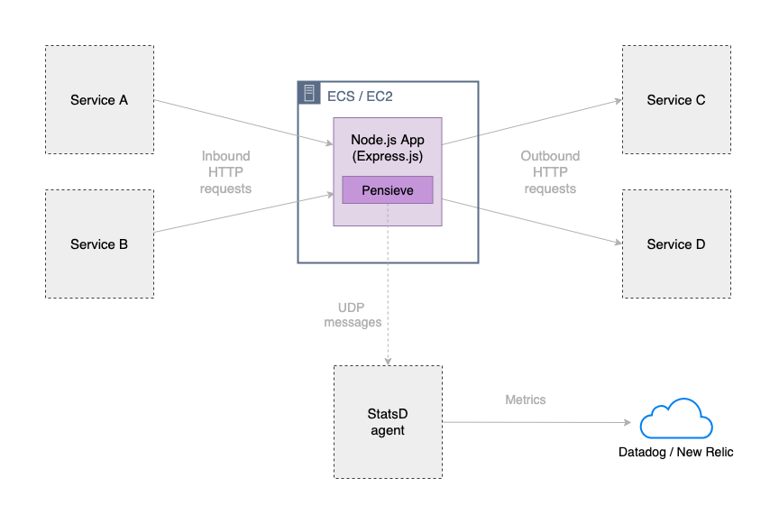

# Pensieve

Pensieve is a **NPM package** to be used in Node.js runtime **applications running on EC2/ECS** integrated with a StatsD agent.
It provides **custom metrics** with useful context related to your application out of the box.

## Table of contents
* [Use cases](#use-cases)
* [Terminology](#terminology)
* [Usage](#usage)
  + [Instantiate a Pensieve instance](#instantiate-a-pensieve-instance)
  + [Instantiate the StatsD client](#instantiate-the-statsd-client)
  + [Instantiate your metrics service](#instantiate-your-metrics-service)
  + [Integration with Express.js](#integration-with-expressjs)
    - [Usage in Express.js applications](#usage-in-expressjs-applications)
    - [Example of Express.js integrations](#example-of-expressjs-integrations)
    - [Express.js integration diagram](#expressjs-integration-diagram)
  + [Submit your own custom metrics](#submit-your-own-custom-metrics)
  + [Fetch ECS metadata information to use in your application](#fetch-ecs-metadata-information-to-use-in-your-application)
* [Metric attributes](#metric-attributes)
  + [Standard attributes](#standard-attributes)
  + [HTTP request metric (inbound and outbound)](#http-request-metric-inbound-and-outbound)
* [Changelog](#changelog)
* [Roadmap](#roadmap)
* [Contributors](#contributors)

## Use cases
- REST API's - Integrated with libraries like [Express.js](https://github.com/expressjs/express)
- SQS long pollers - Integrated with libraries like [sqs-consumer](https://github.com/BBC/sqs-consumer)
 
> To see how to integrate Pensieve with other libraries, check the [examples](examples) folder.

## Terminology

Check out the [Terminology](docs/terminology.md) section for explanations related to the terms used in this documentation and library.

## Usage

To use Pensieve in your application, add it to your required npm libraries:

```bash
$ # cd projects/content-portability
$ npm install @dazn/pensieve
```

### Instantiate a Pensieve instance

```typescript
import { Pensieve } from "@dazn/pensieve"

// Information & context related to your application
// Will be used in the attributes of custom metrics
const applicationData = {
  appName: "content-portability",
  component: "api",
  env: "local",
  awsRegion: "eu-central-1",
  awsAvailabilityZone: "eu-central-1a",
  appVersion: "v0.0.1",
  host: os.hostname(),
  ecsServiceName: "content-portability-dev",
  serviceType: "ECS",
  ecsTaskId: "current-task-id",
  commitHash: "2b5ff7fb"
}

const pensieveInstance = new Pensieve(applicationData)

```

### Instantiate the StatsD client

```typescript

import { StatsD } from "hot-shots"

const statsDClient = new StatsD({
    host: process.env.STATSD_HOST || 'statsd.host.com',
    port: Number(process.env.STATSD_PORT) || 8125,
    maxBufferSize: 8192,
    bufferFlushInterval: 1000
})

```
**Note: while not strictly required, it is highly recommended you add the above environmental variables to your ECS container definition.**

The advantage is that if multiple StatsD agents are running in the same host, switching from one agent to another (for example Datadog to New Relic) does not require any Node.js code changes but only Terraform changes.

### Instantiate your metrics service

```typescript
import { StatsDService } from "@dazn/pensieve"

// The service you can use to create your own custom metrics
const metricsService = new StatsDService(pensieveInstance, statsDClient)

```

Done!


### Integration with Express.js

1. [Usage](#usage-in-expressjs-applications)
2. [Example](#example-of-expressjs-integrations)
3. [Diagram](#expressjs-integration-diagram)

#### Usage in Express.js applications

To monitor **inbound requests**, add this middleware to each route:

```typescript
import { inboundRequest } from "@dazn/pensieve/lib/middleware"

// Versioned API's
app.get("/v1/items", inboundRequest(metricsService, { name: "items_get", version: "v1" }), outboundRequestRoute)

// Unversioned API's
app.get("/items", inboundRequest(metricsService, { name: "items_get" }), outboundRequestRoute)
```

To monitor **outbound requests**, submit the outbound request after the action is perfomed:

```typescript
let statusCode;
const startAt = process.hrtime();
try {
    const response: AxiosResponse = await axiosInstance.get( "https://www.google.nl" );
    statusCode = response.status;
} catch (err) {
    console.log(err);
} finally {
    // Submit the outbound request
    metricsService.submitOutboundRequestMetric({
        httpResponseCode: statusCode,
        target: "google",
        httpMethod: "GET",
        routePath: "google_index_get",
        startAt
    });
}
```

#### Example of Express.js integrations

To see how to integrate Pensieve with an Express.js app, check the [examples](examples/api) folder.

#### Express.js integration diagram

  

<sup>High level diagram of Pensieve integrated in an Express.js app running on ECS</sup>


### Submit your own custom metrics

You can also submit your own custom metrics if you want!    

`metricsService` initialized as [described here](#instantiate-your-metrics-service).    

```typescript
// Supported types: 
// IncrementMetric: increments a stat by 1
// GaugeMetric: gauge a stat by a specified amount
// HistogramMetric: send data for histogram stat (DataDog and Telegraf only)
// TimingMetric: sends a timing command with the specified milliseconds (typical for latencies)
import { IncrementMetric } from "@dazn/pensieve/lib/types"

const myOwnIncrementMetric: IncrementMetric = {
  kind: "increment",
  key: "somethingHappened",
  attributes: {
    foo: "bar" // Your own custom attributes here
  }
}

metricsService.submit(myOwnIncrementMetric)

```

### Fetch ECS metadata information to use in your application

Pensieve also allows you to gather useful context related to the ECS task where the application is running, when applicable.  
For this functionality to work, make sure that your ECS container agent has the setting `ECS_ENABLE_CONTAINER_METADATA=true` enabled.  
[Follow the AWS documentation to check how to enable it for your own cluster.](https://docs.aws.amazon.com/AmazonECS/latest/developerguide/container-metadata.html)

```typescript
const pensieveInstance = new Pensieve(
  applicationData, // Context about your own application
  true             // Enable ECS metadata context, disabled by default
)

// ECS metadata available for you:
loggerInstance.info({
  message: "ECS metadata information for you!",
  private: { ECSMetadataContext: pensieveInstance.getECSMetadataContext() }
})

/**
* Log output:
* {
*  message: 'ECS metadata information for you!',
*  private: {
*    ECSMetadataContext: {
*      cluster: 'test-cluster',
*      ecsTaskId: '2b88376d-aba3-4950-9ddf-bcb0f388a40c',
*      containerName: 'test-container-name',
*      containerInstanceArn: 'arn:aws:ecs:region:acc:container-instance/test-cluster/1f73d099-b914-411c-a9ff-81633b7741dd',
*      ecsServiceName: 'simple-app-service-name',
*      containerId: 'aec2557997f4eed9b280c2efd7afccdced',
*      dockerContainerName: '/ecs-console-example-app-1-e4e8e495e8baa5de1a00',
*      imageId: 'sha256:2ae34abc2ed0a22e280d17e13f',
*      availabilityZone: 'us-east-1b'
*    }
*  }
* }        
**/

```

## Metric attributes

Attributes provide context to each metric.
All the metrics generated by Pensieve have a set of defined attributes, that can be later be used in New Relic or Datadog to filter the queries necessary to create widgets in dashboards.

### Standard attributes

- **env** - The name of the current environment: for example "prod"
- **appName** - The name of your application: for example "content-portability"
- **awsRegion** - The name of the current aws region: for example "eu-central-1"
- **awsAvailabilityZone** - The name of the current aws region: for example "eu-central-1a"
- **component** - The name of the component: for example "api"
- **source** - The source of the incoming data: for example "geofencing" service
- **target** - The target of the outbound data (request or event): for example "user-management" service
- **host** - The name of the current host: for example "local.12345"
- **ecsTaskId** - The ID of the current ECS task (when applicable)
- **ecsServiceName** - The name of the current ECS service (when applicable): for example "content-portability-prod"
- **commitHash** - The current git commit hash: for example "f0a305cace"
- **appVersion** - The current git release tag: for example "0.3.6"


### HTTP request metric (inbound and outbound)

- **routePath** - A normalized unique name for the route: for example "get_content-portability-groups"
- **httpResponseCode** - The status returned by the HTTP response: for example "200"
- **httpMethod** - The status group of the HTTP request/response: for example "GET"
- **httpRequestDirection** - Indicates whether this metrics is about an "inbound" request or "outbound" request
- **apiVersion** - The version of your route: for example "v5"


## Changelog

Please see the [CHANGELOG](CHANGELOG.md) file for more information about what has changed recently.


## Roadmap

- Migration to [Lerna](https://github.com/lerna/lerna)
- Add example of SQS long-polling integration

## Contributors

- [Sara Gerion](https://github.com/saragerion)
- [Marcio Mansur Rabelo](https://github.com/marciomansur)
- [Caio Quirino](https://github.com/caioquirino)
